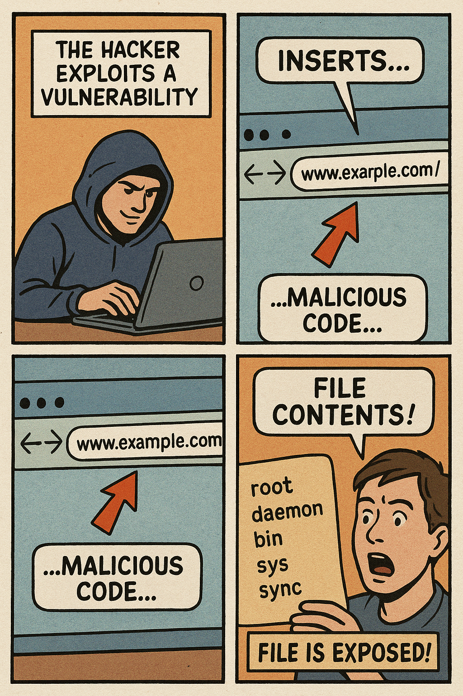
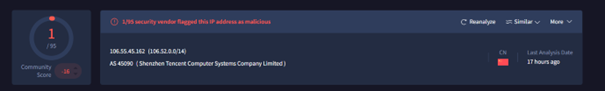

  

SOC170 - Passwd Found in Requested URL - Possible LFI Attack
  

<b>Tomislav Vrbicic</b>

## Incident ID: SOC170-20220301 🔴 High

---

### 1. Summary
An external IP (**106.55.45.162**) attempted a **Local File Inclusion (LFI)** attack on internal web server **WebServer1006** by requesting `/etc/passwd` via the URL.  
The server returned **500 Internal Server Error**, preventing file exposure. ✅

---

### 2. Alert Details

| Field | Value |
|-------|-------|
| EventID | 120 |
| Event Time | Mar 01, 2022, 10:10 AM |
| Rule | SOC170 - Passwd Found in Requested URL - Possible LFI Attack |
| Level | Security Analyst |
| Hostname | WebServer1006 |
| Destination IP | 172.16.17.13 |
| Source IP | 106.55.45.162 |
| HTTP Method | GET |
| Requested URL | `https://172.16.17.13/?file=../../../../etc/passwd` |
| User-Agent | Mozilla/4.0 (compatible; MSIE 6.0; Windows NT 5.1; .NET CLR 1.1.4322) |
| Alert Trigger Reason | URL Contains passwd |
| Device Action | Allowed |
| HTTP Response Status | 500 Internal Server Error |
| HTTP Response Size | 0 |

---

### 3. Source IP Analysis

  

| Field | Value |
|-------|-------|
| IP Address | 106.55.45.162 |
| Network | TencentCloud (China) 🇨🇳 |
| ASN / Route | AS45090, 106.52.0.0/14 |
| Admin Contact | James Tian – johnsonqu@tencent.com |
| Technical Contact | Jimmy Xiao – klayliang@tencent.com |
| Abuse Contact | tencent_noc@tencent.com |
| Reputation | ⚠️ Possibly Malicious – SSH brute-force, web attacks |
| IP Type | Public cloud / dynamic assignment possible |

---

### 4. Destination Device (Internal)

| Field | Value |
|-------|-------|
| IP Address | 172.16.17.13 |
| Hostname | WebServer1006 |
| Device Owner | Unknown |
| Last Logon | Not available |
| Device Role | Web server |
| Security Status | HTTP 500 prevents file access |
| Firewall Action | Allowed |

---

### 5. Event Timeline

| Time | Source | Destination | Event / Action | Status |
|------|--------|-------------|----------------|--------|
| 10:10 AM | 106.55.45.162 | 172.16.17.13 | LFI attempt (`/etc/passwd`) | 🔴 High Risk |
| 10:10 AM | WebServer1006 | 106.55.45.162 | HTTP 500 Response | 🟡 Warning |

---

### 6. SOC Analysis

- ✅ **True Positive Alert:** The alert correctly identified a malicious attempt targeting `/etc/passwd`.  
- ⚠️ **Attack Outcome:** The attack was **unsuccessful**. The server returned a 500 error and did not expose sensitive data.  
- 🛡 **Containment:** No containment required for WebServer1006.  
- 📈 **Escalation:** No Tier 2 SOC escalation required.  
- 🌐 **Attack Source:** External Internet IP originating from China.  

---

### 7. SOC Recommendations

- Block the source IP **106.55.45.162** at the firewall.  
- Monitor for repeat attempts from Tencent Cloud IP ranges.  
- Audit WebServer1006 for signs of compromise.  
- Ensure URL input validation & WAF rules are in place to prevent LFI attacks.  
- Track IP reputation via VirusTotal, Cisco Talos, and AbuseIPDB.  

---

### 8. Reporting & Escalation Contacts

| Role | Contact |
|------|---------|
| Admin Contact | James Tian – johnsonqu@tencent.com |
| Technical Contact | Jimmy Xiao – klayliang@tencent.com |
| Abuse Contact | Tencent NOC – tencent_noc@tencent.com |

---

### 9. Color Legend

- 🔴 High Risk  
- 🟡 Warning  
- 🟢 Normal  

---

### 10. Conclusion
This incident represents a **malicious LFI attempt** from an external Tencent Cloud IP.  
Although the attempt was unsuccessful, it confirms active probing.  
➡️ **Mitigation and monitoring are strongly recommended.**
